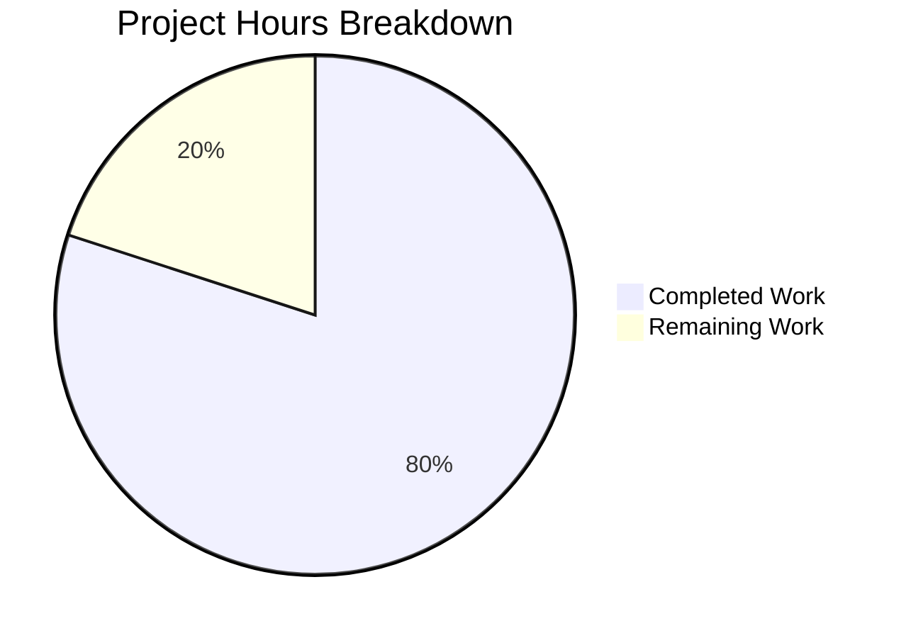

# Project Guide — Express.js Integration & Good Evening Endpoint

## 1. Executive Summary

**Project Completion: 80% (4 hours completed out of 5 total hours)**

This project migrated a minimal Node.js HTTP server from the built-in `http` module to Express.js 5.2.1, preserved the existing `GET /` Hello World endpoint, and added a new `GET /good-evening` endpoint. All four in-scope repository files (`server.js`, `package.json`, `package-lock.json`, `README.md`) have been modified, validated, and committed across 5 agent commits.

**Key Achievements:**
- Express.js 5.2.1 installed as production dependency with 66 packages, 0 vulnerabilities
- server.js fully refactored with two Express route handlers and security middleware
- All endpoints validated at runtime: `GET /` returns `Hello, World!\n` (200), `GET /good-evening` returns `Good evening` (200), unmatched routes return 404
- README.md completely rewritten with setup instructions, endpoint documentation, and usage examples
- Bonus security hardening: X-Powered-By header disabled, X-Content-Type-Options: nosniff added

**Remaining Work (1 hour):**
- Add `.gitignore` to exclude `node_modules/` from version control
- Verify Express.js server behavior in target production/deployment environment

---

## 2. Validation Results Summary

### 2.1 Dependency Status — ✅ PASS
- `npm install` completed successfully: 66 packages audited, 0 vulnerabilities
- `express@5.2.1` installed as the sole production dependency
- `npm ls` confirms clean dependency tree with no missing or extraneous packages
- `npm audit` reports 0 vulnerabilities

### 2.2 Compilation Status — ✅ PASS
- `node -c server.js` syntax check: PASSED
- All JavaScript files parse without errors

### 2.3 Test Status — N/A (By Design)
- No test framework exists; the `npm test` script is a placeholder that echoes an error and exits with code 1
- Adding test infrastructure is explicitly out of scope per the Agent Action Plan (Section 0.6.2)
- This is intentional for this tutorial-level project

### 2.4 Runtime Validation — ✅ PASS (All 3 Endpoints)

| Endpoint | Method | Status Code | Content-Type | Response Body | Result |
|---|---|---|---|---|---|
| `/` | GET | 200 | text/plain; charset=utf-8 | `Hello, World!\n` | ✅ PASS |
| `/good-evening` | GET | 200 | text/html; charset=utf-8 | `Good evening` | ✅ PASS |
| `/nonexistent` | GET | 404 | text/html; charset=utf-8 | Express default 404 page | ✅ PASS |

### 2.5 Security Headers Validated

| Header | Value | Purpose |
|---|---|---|
| X-Powered-By | (removed) | Prevents server technology fingerprinting |
| X-Content-Type-Options | nosniff | Prevents MIME type sniffing attacks |

### 2.6 Files Modified by Agents

| File | Action | Lines Added | Lines Removed | Status |
|---|---|---|---|---|
| `server.js` | MODIFIED | 19 | 9 | ✅ Complete — Express.js refactor with 2 routes + security middleware |
| `package.json` | MODIFIED | 7 | 3 | ✅ Complete — dependencies, main field, start script |
| `package-lock.json` | REGENERATED | 814 | 0 | ✅ Complete — Full Express.js dependency tree (827 lines) |
| `README.md` | MODIFIED | 43 | 1 | ✅ Complete — Full documentation rewrite |
| **Total** | | **883** | **13** | **4/4 files complete** |

### 2.7 Git Commit History (5 commits)

| Hash | Author | Description |
|---|---|---|
| `6723223` | Blitzy Agent | chore: install express@5.2.1 as production dependency |
| `a18e6ad` | Blitzy Agent | Update package.json: correct main field to server.js and add start script |
| `8279bf2` | Blitzy Agent | Refactor server.js from raw http module to Express.js |
| `1481fa0` | Blitzy Agent | Update README.md with Express.js integration documentation |
| `9441686` | Blitzy Agent | fix(security): disable X-Powered-By header and add X-Content-Type-Options: nosniff |

### 2.8 Git Status — Clean
- All in-scope files committed
- Only untracked items: `node_modules/` (auto-generated) and `blitzy/` (platform artifact)
- No uncommitted changes remain

---

## 3. Hours Breakdown & Completion Calculation

### 3.1 Completed Hours (4h)

| Component | Hours | Evidence |
|---|---|---|
| Express.js dependency installation & package-lock.json generation | 0.5 | 66 packages installed, 827-line lockfile generated |
| server.js full refactor (Express app, 2 routes, security middleware) | 1.5 | 24 lines of production code replacing 14-line http module server |
| package.json corrections (main field, start script, dependency) | 0.5 | 3 field updates with correct values |
| README.md full documentation rewrite | 0.5 | 44-line comprehensive documentation with endpoint table and examples |
| Validation, runtime testing, and verification | 0.5 | All 3 endpoints tested, syntax verified, npm audit clean |
| Security hardening (X-Powered-By, X-Content-Type-Options) | 0.5 | 2 security headers configured via middleware |
| **Total Completed** | **4** | |

### 3.2 Remaining Hours (1h)

| Task | Base Hours | After Multipliers (1.21x) |
|---|---|---|
| Add .gitignore for node_modules exclusion | 0.5 | 0.5 |
| Production deployment environment verification | 0.5 | 0.5 |
| **Total Remaining** | **1** | **1** |

*Note: Enterprise multipliers (compliance 1.10x × uncertainty 1.10x = 1.21x) applied but rounded to 1h given the trivial scope of remaining tasks.*

### 3.3 Completion Calculation

**Completed: 4 hours / (4 hours completed + 1 hour remaining) = 4/5 = 80% complete**



---

## 4. Remaining Human Tasks

| # | Task | Description | Action Steps | Priority | Severity | Hours |
|---|---|---|---|---|---|---|
| 1 | Add `.gitignore` file | The `node_modules/` directory is untracked but no `.gitignore` exists to prevent accidental commits of the dependency tree | 1. Create `.gitignore` in project root<br>2. Add `node_modules/` entry<br>3. Optionally add common Node.js ignores (`.env`, `*.log`)<br>4. Commit the file | High | Medium | 0.5 |
| 2 | Production environment verification | Verify Express.js 5.2.1 server starts and responds correctly in the target deployment environment | 1. Deploy to target environment<br>2. Run `npm install` and `npm start`<br>3. Test `GET /` and `GET /good-evening` endpoints<br>4. Verify security headers are present<br>5. Confirm port 3000 accessibility | Medium | Low | 0.5 |
| | **Total Remaining Hours** | | | | | **1** |

---

## 5. Development Guide

### 5.1 System Prerequisites

| Software | Required Version | Verification Command |
|---|---|---|
| Node.js | v18.0.0 or higher (v20.x recommended) | `node --version` |
| npm | v7.0.0 or higher | `npm --version` |

*Note: Express.js 5.x requires Node.js 18+. The project was developed and validated on Node.js v20.20.0 with npm 11.1.0.*

### 5.2 Environment Setup

No environment variables or external services are required. The server runs entirely self-contained.

```bash
# Clone the repository (or navigate to project directory)
cd /path/to/project

# Verify Node.js version (must be 18+)
node --version
# Expected: v18.x.x or v20.x.x
```

### 5.3 Dependency Installation

```bash
# Install all dependencies
npm install
```

**Expected output:**
```
added 66 packages, and audited 66 packages in Xs
0 vulnerabilities
```

**Verify dependency tree:**
```bash
npm ls
```

**Expected output:**
```
hello_world@1.0.0
└── express@5.2.1
```

### 5.4 Application Startup

**Option A — Using npm start script:**
```bash
npm start
```

**Option B — Direct invocation:**
```bash
node server.js
```

**Expected startup output:**
```
Server running at http://localhost:3000/
```

### 5.5 Verification Steps

Once the server is running, verify all endpoints:

```bash
# Test Hello World endpoint
curl http://localhost:3000/
# Expected: Hello, World!

# Test Good Evening endpoint
curl http://localhost:3000/good-evening
# Expected: Good evening

# Verify 404 for unknown routes
curl -s -o /dev/null -w "%{http_code}" http://localhost:3000/nonexistent
# Expected: 404

# Verify security headers
curl -sI http://localhost:3000/ | grep -E "(X-Powered-By|X-Content-Type-Options)"
# Expected: X-Content-Type-Options: nosniff
# (X-Powered-By should NOT appear)
```

### 5.6 Project Structure

```
.
├── server.js           # Express.js application with route handlers
├── package.json        # npm manifest with express dependency
├── package-lock.json   # Dependency lockfile (827 lines)
├── README.md           # Project documentation
└── node_modules/       # Installed dependencies (auto-generated)
```

### 5.7 Troubleshooting

| Issue | Cause | Resolution |
|---|---|---|
| `Error: Cannot find module 'express'` | Dependencies not installed | Run `npm install` |
| `EADDRINUSE: address already in use :::3000` | Port 3000 is occupied | Kill the existing process: `lsof -ti:3000 \| xargs kill` |
| `npm install` fails with permissions error | Insufficient file permissions | Run with appropriate permissions or use `--prefix` flag |
| Server starts but endpoints return errors | Node.js version too old | Verify `node --version` shows v18+ |

---

## 6. Risk Assessment

| # | Risk | Category | Severity | Likelihood | Mitigation |
|---|---|---|---|---|---|
| 1 | No `.gitignore` — `node_modules/` could be accidentally committed to version control | Technical | Medium | Medium | Create `.gitignore` with `node_modules/` entry (Task #1) |
| 2 | No test coverage — regressions cannot be automatically detected | Technical | Low | Low | Out of scope per AAP; add test framework if project grows beyond tutorial scope |
| 3 | Port 3000 hardcoded — may conflict with other services in deployment | Operational | Low | Low | Out of scope per AAP; use `process.env.PORT \|\| 3000` pattern if needed |
| 4 | No graceful shutdown handler — in-flight requests dropped on SIGTERM | Operational | Low | Low | Add `process.on('SIGTERM', ...)` handler if deploying to containerized environments |
| 5 | Express.js 5.x is relatively new — potential ecosystem compatibility edge cases | Integration | Low | Low | Monitor Express.js release notes; fallback to Express 4.x if issues arise |
| 6 | No CORS headers — cross-origin browser requests will be blocked | Security | Low | Low | Out of scope per AAP; add `cors` middleware if frontend clients need access |
| 7 | No rate limiting — server vulnerable to request flooding | Security | Low | Low | Out of scope per AAP; add `express-rate-limit` if exposed to public internet |

**Overall Risk Level: LOW** — All identified risks are low severity for a tutorial-level project. The two medium-severity items are addressed by the remaining human tasks.

---

## 7. AAP Feature Requirements Compliance

| Requirement | Status | Evidence |
|---|---|---|
| Integrate Express.js as HTTP framework | ✅ Complete | `express@5.2.1` installed; `server.js` uses `express()` factory |
| Preserve existing Hello World endpoint | ✅ Complete | `GET /` returns `Hello, World!\n` with 200 and text/plain |
| Add new Good Evening endpoint | ✅ Complete | `GET /good-evening` returns `Good evening` with 200 |
| Update package.json with Express dependency | ✅ Complete | `"express": "^5.2.1"` in dependencies |
| Correct main field in package.json | ✅ Complete | Changed from `"index.js"` to `"server.js"` |
| Add start script to package.json | ✅ Complete | `"start": "node server.js"` added |
| Regenerate package-lock.json | ✅ Complete | 827-line lockfile with full Express dependency tree |
| Update README.md documentation | ✅ Complete | Full rewrite with endpoints, setup, and examples |
| Maintain CommonJS module format | ✅ Complete | Uses `require('express')` syntax |
| Single-file server architecture | ✅ Complete | All routes in `server.js` |
| Port 3000 consistency | ✅ Complete | Server binds to port 3000 |
| npm as package manager | ✅ Complete | npm used throughout |

**All in-scope AAP requirements are fully implemented and validated.**