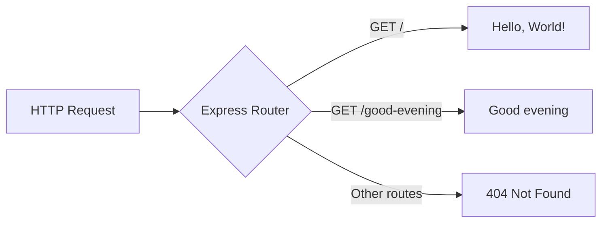

# Technical Specification

# 0. Agent Action Plan

## 0.1 Intent Clarification

### 0.1.1 Core Feature Objective

Based on the prompt, the Blitzy platform understands that the new feature requirement is to:

- **Integrate Express.js as the HTTP framework** — Replace the current raw Node.js `http` module server implementation in `server.js` with an Express.js-based server, introducing a proper web application framework to the project that currently has zero external dependencies.
- **Preserve the existing "Hello World" endpoint** — The current server responds with `Hello, World!\n` to all incoming HTTP requests. This behavior must be preserved as a dedicated route endpoint so that the existing functionality continues to work after the migration.
- **Add a new "Good evening" endpoint** — Create an additional HTTP GET endpoint that returns the response `"Good evening"` when accessed, expanding the server from a single-behavior fixture into a multi-route application.
- **Transition from zero-dependency to Express-based architecture** — The project currently uses only the built-in `http` module with no external packages. Adding Express.js fundamentally changes the project's dependency posture, requiring updates to `package.json`, `package-lock.json`, and the server entry point.

**Implicit requirements detected:**

- The `package.json` manifest must be updated with Express.js as a production dependency
- The `package-lock.json` lockfile must be regenerated to capture the Express.js dependency tree
- The `main` field in `package.json` currently points to `index.js` (which does not exist); this should be corrected to point to `server.js`
- The server must continue listening on a configurable or consistent host and port
- Route separation must be introduced where none currently exists (the current handler treats all paths identically)

### 0.1.2 Special Instructions and Constraints

- **No specific architectural directives were provided** — The user described this as a tutorial project, implying the implementation should favor clarity and simplicity over advanced patterns.
- **Backward compatibility consideration** — The existing `Hello, World!` response must remain accessible after Express.js integration, though it will now be route-specific rather than a catch-all response.
- **No version constraint specified** — The user did not specify an Express.js version. The latest stable release (`5.2.1`) will be used as it is the current npm default.
- **No design system or UI components are involved** — This is a backend-only server project with no frontend rendering, so the Design System Alignment Protocol is not applicable.

User Example: *"add another endpoint that return the response of 'Good evening'"*

### 0.1.3 Technical Interpretation

These feature requirements translate to the following technical implementation strategy:

- To **integrate Express.js**, we will install `express@5.2.1` as a production dependency via npm and refactor `server.js` to use Express's application factory (`express()`) and routing methods instead of the raw `http.createServer()` API.
- To **preserve the Hello World endpoint**, we will create an Express route handler using `app.get('/', ...)` that sends the response `Hello, World!\n` with a `200` status code and `text/plain` content type, matching the current behavior.
- To **add the Good Evening endpoint**, we will create a new Express route handler using `app.get('/good-evening', ...)` that sends the response `Good evening` with a `200` status code.
- To **update project configuration**, we will modify `package.json` to declare `express` as a dependency, add a `start` script for convenient server startup, correct the `main` field, and regenerate `package-lock.json` to capture the full Express.js dependency tree.
- To **update documentation**, we will modify `README.md` to reflect the new Express.js-based architecture, available endpoints, and usage instructions.


## 0.2 Repository Scope Discovery

### 0.2.1 Comprehensive File Analysis

The repository root contains exactly four files with no subdirectories. Every file in the repository is affected by this feature addition.

**Existing Files Requiring Modification:**

| File Path | Current Purpose | Modification Required | Impact Level |
|---|---|---|---|
| `server.js` | Raw `http` module server; responds `Hello, World!\n` to all requests on `127.0.0.1:3000` | Complete refactor to Express.js application with route-based handlers | Critical |
| `package.json` | npm manifest with zero dependencies; name `hello_world`, version `1.0.0` | Add `express` dependency, add `start` script, correct `main` field | Critical |
| `package-lock.json` | Lockfile with zero resolved packages (lockfileVersion 3) | Regenerated automatically by npm after Express.js installation | Critical |
| `README.md` | Two-line project description with immutability directive | Update to document Express.js integration, endpoints, and usage | Medium |

**Integration Point Discovery:**

- **API endpoints connecting to the feature:**
  - `GET /` — Existing Hello World response, now route-specific
  - `GET /good-evening` — New endpoint returning "Good evening"
- **Server initialization:** The `http.createServer()` call in `server.js` (line 6) is replaced by `express()` application factory and `app.listen()`
- **No database models/migrations** — The project has no data persistence layer
- **No service classes** — The project has no service abstraction; all logic is inline
- **No middleware/interceptors** — No middleware exists currently; Express.js may optionally introduce basic middleware

### 0.2.2 Web Search Research Conducted

- **Express.js latest stable version:** Confirmed as `5.2.1` via npm registry. Express 5 was officially released as the npm default, requiring Node.js 18+ (the project runs Node.js v20.20.0, satisfying this requirement).
- **Express 5 key features relevant to this project:** Native async/await middleware support, improved error handling with automatic rejected promise catching, updated `path-to-regexp@8.x` for routing, and dropped support for Node.js versions before v18.
- **Best practices for Express.js minimal servers:** Use `express()` factory to create the app, define routes with `app.get()`, and start with `app.listen()`. For simple projects, all routes can reside in the main server file.
- **Express.js basic routing pattern:** Route handlers follow the signature `app.METHOD(path, handler)` where `handler` receives `(req, res)` parameters and uses `res.send()` or `res.end()` to send responses.

### 0.2.3 New File Requirements

**New source files to create:**

No new source files are required. The project's tutorial nature and minimal scope mean all new functionality (Express.js integration and the new endpoint) is implemented within the existing `server.js` file. The refactored `server.js` will contain both route handlers.

**New test files:**

No test files exist in the current project (the `npm test` script is a placeholder that exits with code 1). While adding tests would be beneficial, no test infrastructure was requested by the user.

**New configuration files:**

No new configuration files are needed. All Express.js configuration (port, hostname) will be defined inline in `server.js`, consistent with the project's tutorial-level simplicity.

**Automatically generated files:**

- `node_modules/` — Created by `npm install` when adding the Express.js dependency; contains Express.js and its transitive dependencies
- `package-lock.json` — Regenerated by npm to capture the complete Express.js dependency tree


## 0.3 Dependency Inventory

### 0.3.1 Private and Public Packages

The project currently has zero external dependencies. This feature addition introduces one new public dependency and its transitive dependency tree.

**Current Dependencies (Pre-Change):**

| Registry | Package Name | Version | Purpose |
|---|---|---|---|
| (built-in) | `http` | Bundled with Node.js | HTTP server creation — the sole module import in `server.js` |

**New Dependencies (Post-Change):**

| Registry | Package Name | Version | Purpose |
|---|---|---|---|
| npm (public) | `express` | `5.2.1` | Web application framework — provides routing, middleware pipeline, and HTTP utilities to replace the raw `http.createServer()` approach |

**Runtime Environment:**

| Component | Version | Evidence |
|---|---|---|
| Node.js | v20.20.0 | Installed runtime; no `.nvmrc` or `engines` field specified in `package.json` |
| npm | 11.1.0 | Installed package manager; lockfileVersion 3 in `package-lock.json` confirms npm v7+ compatibility |

**Version Justification:**

- Express `5.2.1` is the latest stable release published on the npm registry. Express 5.1.0 was designated the `latest` tag on npm, and 5.2.1 is the most recent patch. Express 5 requires Node.js 18+, and the project's Node.js v20.20.0 runtime satisfies this constraint.

### 0.3.2 Dependency Updates

**Import Updates:**

The single import statement in `server.js` will change from the built-in `http` module to the `express` package:

- Old: `const http = require('http');`
- New: `const express = require('express');`

Files requiring import updates:

| File Pattern | Import Change | Reason |
|---|---|---|
| `server.js` | Replace `require('http')` with `require('express')` | Express.js replaces the raw `http` module for server creation and request handling |

**External Reference Updates:**

| File | Update Required |
|---|---|
| `package.json` | Add `"dependencies": { "express": "^5.2.1" }`, add `"start": "node server.js"` to scripts, update `"main"` from `"index.js"` to `"server.js"` |
| `package-lock.json` | Fully regenerated by `npm install` to include Express.js and all transitive dependencies |
| `README.md` | Update project description to reflect Express.js integration and available endpoints |


## 0.4 Integration Analysis

### 0.4.1 Existing Code Touchpoints

**Direct modifications required:**

- **`server.js` (lines 1–14, entire file):** The complete server implementation must be refactored. The current flow — `http.createServer()` with a single anonymous callback handler, `res.statusCode`, `res.setHeader()`, and `res.end()` — is replaced by the Express.js application pattern: `express()` factory, `app.get()` route definitions, and `app.listen()` binding.
  - Line 1: Replace `const http = require('http');` with `const express = require('express');`
  - Lines 3–4: Retain `hostname` and `port` constants (or simplify to port-only for Express)
  - Lines 6–10: Replace `http.createServer((req, res) => { ... })` with Express app initialization and two route handlers
  - Lines 12–14: Replace `server.listen(port, hostname, ...)` with `app.listen(port, ...)`

- **`package.json` (lines 1–11, entire file):** Three modifications are required within the manifest:
  - Add `dependencies` block: `{ "express": "^5.2.1" }`
  - Update `scripts.start`: Add `"start": "node server.js"` for convenient startup
  - Update `main` field: Change from `"index.js"` to `"server.js"` to correct the existing inconsistency

- **`package-lock.json` (lines 1–13, entire file):** This file will be completely regenerated by npm when Express.js is installed. The `packages` object will expand from a single root entry to include Express.js and all its transitive dependencies.

- **`README.md` (lines 1–2, entire file):** Update the documentation to describe the Express.js-based server, list available endpoints, and provide updated usage instructions.

**Dependency injections:**

- No dependency injection containers or service registries exist in this project. Express.js integration is direct — the `express` module is imported and used immediately in `server.js`.

**Database/Schema updates:**

- Not applicable. The project has no database, no data models, and no persistence layer. The feature addition does not introduce any data storage requirements.

### 0.4.2 Server Behavior Changes

The following table maps how server behavior transitions from the current `http` module implementation to the Express.js implementation:

| Behavior | Before (http module) | After (Express.js) |
|---|---|---|
| Server creation | `http.createServer(callback)` | `express()` application factory |
| Route handling | Single catch-all callback for all methods and paths | Explicit `app.get('/', ...)` and `app.get('/good-evening', ...)` route handlers |
| Response for `GET /` | `Hello, World!\n` (200, text/plain) | `Hello, World!\n` (200, text/plain) — preserved |
| Response for `GET /good-evening` | `Hello, World!\n` (same as all paths) | `Good evening` (200) — new endpoint |
| Response for unmatched routes | `Hello, World!\n` (same as all paths) | Express default 404 response |
| Binding | `server.listen(port, hostname, callback)` | `app.listen(port, callback)` |
| Startup log | `Server running at http://127.0.0.1:3000/` | Updated log reflecting Express.js server |




## 0.5 Technical Implementation

### 0.5.1 File-by-File Execution Plan

Every file listed below MUST be created or modified to complete this feature addition.

**Group 1 — Core Feature Files:**

- **MODIFY: `server.js`** — Refactor the entire server implementation from raw `http` module to Express.js. Replace `http.createServer()` with `express()` application factory. Define `GET /` route handler returning `Hello, World!\n` and `GET /good-evening` route handler returning `Good evening`. Replace `server.listen()` with `app.listen()` on port `3000`.

**Group 2 — Project Configuration:**

- **MODIFY: `package.json`** — Add `express@^5.2.1` under a new `dependencies` field. Add `"start": "node server.js"` to the `scripts` block. Correct the `main` field from `"index.js"` to `"server.js"`.
- **AUTO-GENERATED: `package-lock.json`** — Fully regenerated by `npm install` after adding Express.js to `package.json`. Will expand from a single root entry to include the Express.js dependency tree.

**Group 3 — Documentation:**

- **MODIFY: `README.md`** — Update project description to reflect Express.js integration. Document both available endpoints (`GET /` and `GET /good-evening`) with expected responses. Include updated setup and run instructions.

### 0.5.2 Implementation Approach per File

**Step 1: Install Express.js dependency**

Run `npm install express` in the project root. This adds `express@^5.2.1` to `package.json` under `dependencies` and regenerates `package-lock.json` with the full dependency tree.

**Step 2: Refactor `server.js`**

Establish the Express.js foundation by replacing the entire `server.js` contents. The refactored file will:

- Import `express` instead of `http`
- Create an Express application instance via `express()`
- Define the `GET /` route that sends `Hello, World!\n` with `text/plain` content type
- Define the `GET /good-evening` route that sends `Good evening`
- Bind the application to port `3000` with a startup confirmation log

Target structure for `server.js`:

```javascript
const express = require('express');
const app = express();
const port = 3000;
```

The root route preserves the original behavior:

```javascript
app.get('/', (req, res) => {
  res.type('text/plain').send('Hello, World!\n');
});
```

The new endpoint adds the requested feature:

```javascript
app.get('/good-evening', (req, res) => {
  res.send('Good evening');
});
```

**Step 3: Update `package.json`**

Correct the `main` field and add the `start` script alongside the Express.js dependency that was auto-added by npm in Step 1.

**Step 4: Update `README.md`**

Replace the current two-line description with documentation covering the project purpose, setup instructions (`npm install` followed by `npm start` or `node server.js`), and a table of available endpoints with their expected responses.

### 0.5.3 User Interface Design

Not applicable. This project is a backend-only Node.js HTTP server with no frontend, UI components, or browser-rendered content. All responses are plain text strings returned via HTTP endpoints.


## 0.6 Scope Boundaries

### 0.6.1 Exhaustively In Scope

Every file and artifact that must be created, modified, or regenerated as part of this feature addition:

**Source Files:**

| File Pattern | Action | Purpose |
|---|---|---|
| `server.js` | MODIFY | Refactor from `http` module to Express.js; add two route handlers (`GET /`, `GET /good-evening`) |

**Configuration Files:**

| File Pattern | Action | Purpose |
|---|---|---|
| `package.json` | MODIFY | Add `express@^5.2.1` dependency, add `start` script, correct `main` field |
| `package-lock.json` | REGENERATE | Auto-generated by npm to capture Express.js and all transitive dependencies |

**Documentation Files:**

| File Pattern | Action | Purpose |
|---|---|---|
| `README.md` | MODIFY | Update project description, endpoint documentation, and setup instructions |

**Auto-Generated Artifacts:**

| Path Pattern | Action | Purpose |
|---|---|---|
| `node_modules/**/*` | CREATE | npm-managed directory containing Express.js and its transitive dependencies |

**Complete In-Scope File List:**

- `server.js` — Core server implementation (MODIFY)
- `package.json` — npm manifest with dependency and script declarations (MODIFY)
- `package-lock.json` — Dependency lockfile (REGENERATE)
- `README.md` — Project documentation (MODIFY)
- `node_modules/` — Dependency installation directory (CREATE via npm)

### 0.6.2 Explicitly Out of Scope

The following items are deliberately excluded from this feature addition:

- **Test infrastructure** — No test framework (Jest, Mocha, etc.) will be added; the existing placeholder `npm test` script will not be replaced with a functional test suite
- **TypeScript migration** — The project remains in plain JavaScript (CommonJS); no TypeScript configuration or type definitions will be introduced
- **Environment variable configuration** — Port and host values remain hardcoded constants; no `.env` file or `dotenv` integration will be added
- **Middleware stack** — No Express.js middleware (body-parser, cors, helmet, morgan, etc.) will be added beyond what Express.js includes by default
- **Error handling middleware** — No custom Express.js error handling middleware will be implemented
- **Additional endpoints beyond the two specified** — Only `GET /` and `GET /good-evening` are in scope
- **Docker or containerization** — No Dockerfile, docker-compose, or container configuration will be created
- **CI/CD pipeline** — No GitHub Actions, GitLab CI, or other CI/CD configuration will be added
- **Database or data persistence** — No database, ORM, or data storage layer will be introduced
- **Logging framework** — No structured logging (Winston, Pino, Morgan) will be added; basic `console.log` is retained
- **Performance optimization** — No clustering, load balancing, or caching mechanisms will be implemented
- **API versioning or documentation** — No Swagger/OpenAPI specs or API versioning will be introduced
- **Refactoring of unrelated code** — No changes to files or patterns beyond what is required for Express.js integration and the new endpoint


## 0.7 Rules for Feature Addition

The following rules govern the implementation of this feature addition, derived from the user's instructions and the project's existing conventions:

- **Preserve existing endpoint behavior** — The `GET /` route must continue to return `Hello, World!\n` with a `200` status code and `text/plain` content type, matching the exact output of the current `http` module implementation. Any deviation from the current response body, status code, or content type for this endpoint is a regression.

- **Response text fidelity** — The new endpoint must return exactly `Good evening` as specified by the user. The response text must not include trailing newlines, additional formatting, or HTML wrapping unless explicitly stated.

- **Maintain tutorial-level simplicity** — The user described this as a tutorial project. All code must prioritize readability and clarity over advanced patterns. Avoid unnecessary abstractions, complex folder structures, or enterprise-level architecture patterns.

- **CommonJS module format** — The existing project uses CommonJS `require()` syntax. All new code must follow this convention. Do not introduce ES module (`import/export`) syntax.

- **Single-file server architecture** — All route handlers and server configuration remain in `server.js`. Do not split routes into separate files or create a multi-file Express application structure, as this is inconsistent with the project's tutorial nature.

- **Port consistency** — The server must continue to listen on port `3000` to maintain consistency with the existing implementation and any external tooling or documentation that references this port.

- **No user-specified version constraints** — The user did not specify an Express.js version. Use the latest stable release (`5.2.1`) as confirmed from the npm registry. Pin the dependency with a caret range (`^5.2.1`) to allow compatible patch and minor updates per semver.

- **npm as the package manager** — The project uses npm (evidenced by `package-lock.json`). Continue using npm for all dependency management operations. Do not introduce yarn, pnpm, or other package managers.


## 0.8 References

### 0.8.1 Repository Files and Folders Searched

All files in the repository were retrieved and analyzed to derive the conclusions in this Agent Action Plan:

| File Path | Purpose | Key Findings |
|---|---|---|
| `server.js` | HTTP server entry point (14 lines) | Uses `http.createServer()` with a single catch-all handler; responds `Hello, World!\n` to all requests; binds to `127.0.0.1:3000`; uses CommonJS `require('http')` |
| `package.json` | npm manifest (11 lines) | Name: `hello_world`, version: `1.0.0`, author: `hxu`, license: MIT; zero dependencies; `main` field incorrectly points to `index.js`; placeholder test script |
| `package-lock.json` | Dependency lockfile (13 lines) | lockfileVersion 3 (npm v7+); zero resolved third-party packages; single root entry only |
| `README.md` | Project documentation (2 lines) | Names project as `hao-backprop-test`; describes it as a test project for backprop integration; contains "Do not touch!" directive |

**Folder structure:** The repository root (`/`) was the only directory explored. The project has zero subdirectories — all four files reside at the root level.

### 0.8.2 Technical Specification Sections Referenced

The following existing tech spec sections were consulted for context and cross-referencing:

| Section | Key Information Extracted |
|---|---|
| 1.1 Executive Summary | Project purpose as a Backprop test fixture; zero-dependency design philosophy; immutability constraint |
| 2.1 Feature Catalog | Six existing features (F-001 through F-006); static HTTP response service; localhost binding; package metadata |
| 3.1 Technology Stack Overview | Zero-dependency, single-runtime stack; Node.js with built-in `http` module only; no frameworks |
| 3.4 Frameworks and Libraries | Confirmed zero frameworks and zero external libraries; deliberate architectural decision |
| 3.5 Open Source Dependencies | Zero external dependencies; lockfileVersion 3 analysis; npm v7+ requirement |
| 4.3 HTTP Request Processing Flow | Single unconditional handler; no routing, no middleware, no input processing |
| 5.1 High-Level Architecture | Monolithic single-file architecture; system boundaries; data flow patterns |

### 0.8.3 External Research Conducted

| Research Topic | Source | Key Finding |
|---|---|---|
| Express.js latest stable version | npm registry (`npmjs.com/package/express`) | Latest version: `5.2.1`; Express 5.1.0 designated as npm `latest` tag |
| Express.js 5 release details | GitHub Releases (`github.com/expressjs/express/releases`) | Express 5 requires Node.js 18+; updated `path-to-regexp@8.x`; native async/await middleware support |
| Express.js 5 LTS timeline | expressjs.com announcement | Express 5.1.0 is the default on npm with official LTS schedule for v4 and v5 release lines |

### 0.8.4 Attachments

No attachments were provided for this project. No Figma designs, wireframes, or external design assets are referenced.


